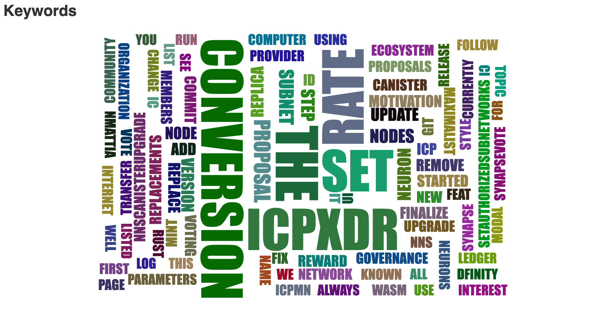
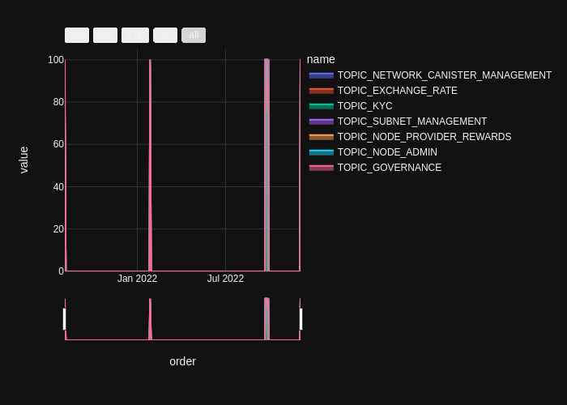
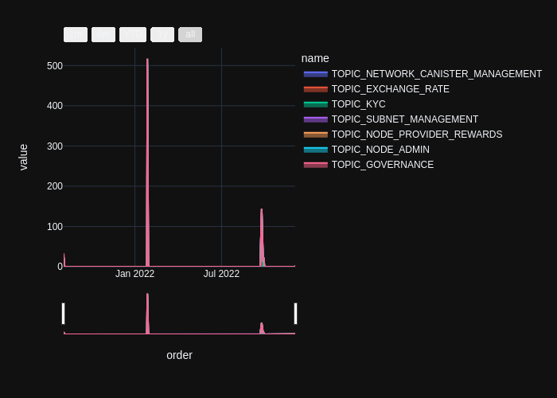
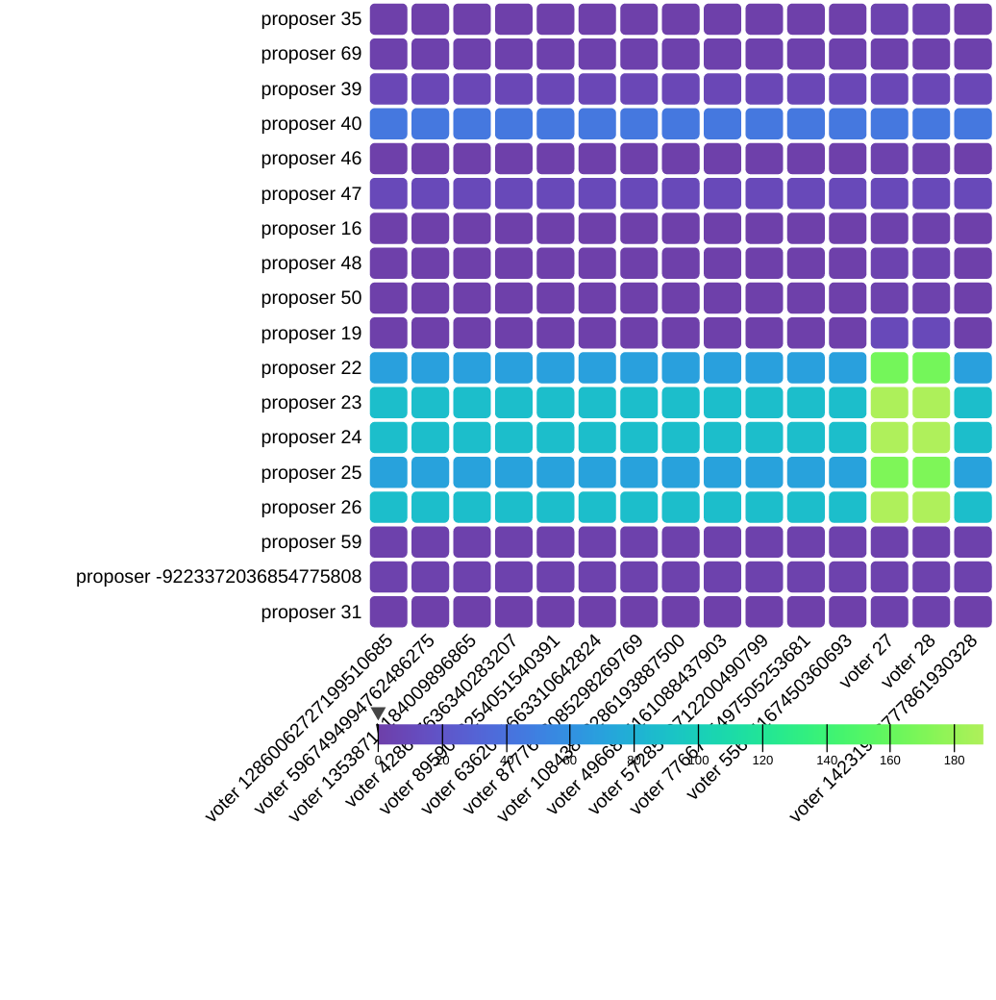
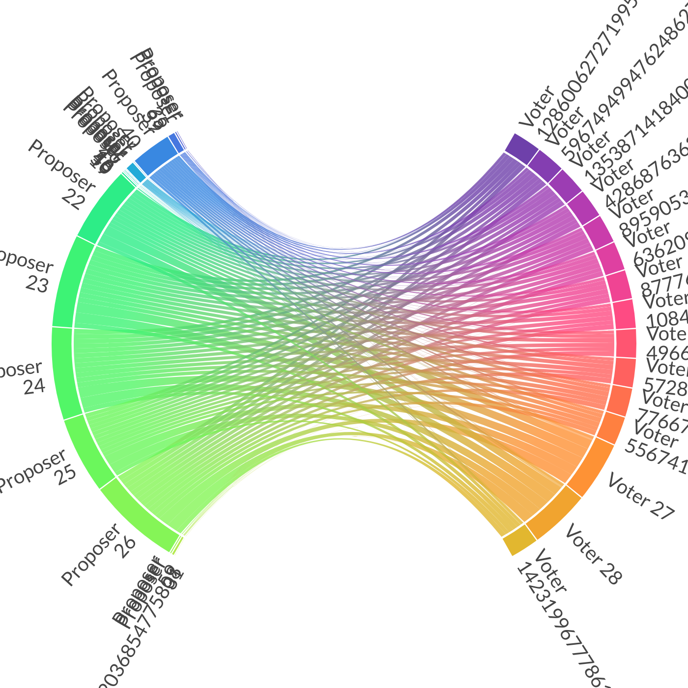
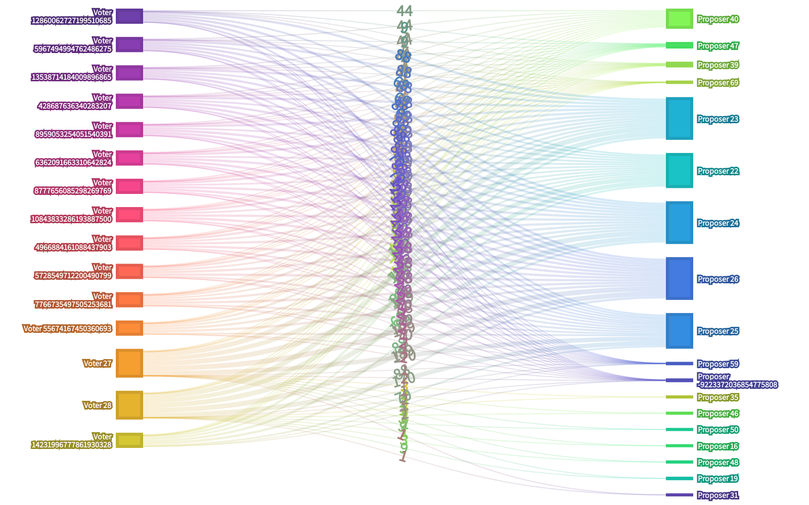
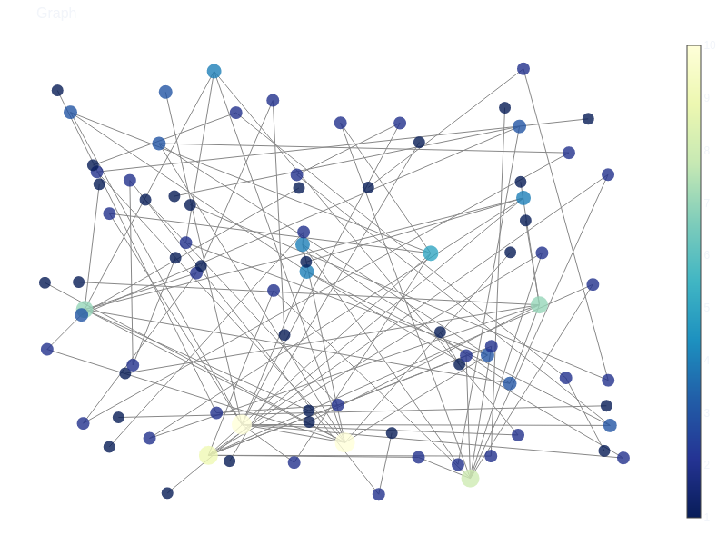

# Network Nervous System Visualizations
## Blockchain Governance on the Internet Computer
## Visualizations

[Click here to see the interactive terminus figure](https://sunshineluyao.github.io/ic-gov-visualization/figs/Terminus.html)

https://user-images.githubusercontent.com/48966917/209564821-07b48f8b-a160-40d5-85d4-b1c8fc566b0c.mp4

The Terminus figure shows the voting flow from the top voters to the top proposers. A particle in the animation represents one vote from a voter to a proposer. The thicker the bar is, the more votes a proposer receives and the more times a voter votes. The current figures shows only the selective voter and proposer flow under the condition that the voter on the left hand side votes more than 10 times for the proposer on the right hand side. 

### 1. The Wordcloud of Proposal Summaries
[Click here to see the interactive wordcloud figure](https://sunshineluyao.github.io/ic-gov-visualization/figs/wordcloud.html)

The Wordcloud shows the keywords statistics in the proposal summary of all proposals on the Network Nervous System (NNS). By hovering the mouse on a keyword, a info window will pop up saying how many time the keyword appeared.

### 2. The Time Series of Proposals by Topics
#### 2.1. The Fractions
[Click here to see the interactive figure](https://sunshineluyao.github.io/ic-gov-visualization/figs/area_fraction.html)

The area chart shows the time series of NNS proposals with selected topics by date. Users can filter the time period using the time range slider. The y axis represents the fraction of each topic among the total proposals.

#### 2.2. The Percentage

[Click here to see the interactive figure](https://sunshineluyao.github.io/ic-gov-visualization/figs/area_percent.html)

The area chart shows the time series of NNS proposals with selected topics by date. Users can filter the time period using the time range slider. The y axis represents the percentage of each topic among the total proposals.

#### 2.3. The Count

[Click here to see the interactive figure](https://sunshineluyao.github.io/ic-gov-visualization/figs/area_count.html)

The area chart shows the time series of NNS proposals with selected topics by date. Users can filter the time period using the time range slider. The y axis represents the count of each topic among the total proposals.

### 3. Proposer and Voter Network 

#### 3.1. Heatmap
[Click here to see the interactive figure](https://sunshineluyao.github.io/ic-gov-visualization/figs/heatmap.html)

https://user-images.githubusercontent.com/48966917/209565183-7a202e78-80ad-40e2-99a5-9592252f38ea.mp4

The Heatmap shows the voting count from all voters to all proposers. The prooposers are listed on the y-axis and the voters are listed on the x-axis.The color of each cell demonstrate the count of votes from the voter on the x-coordinate to the proposer on the y-coordinate. When hovering on the heatmap, an info window will show up to display how man times a voter votes for a proposer.

#### 3.2. SplitChord
[Click here to see the interactive figure](https://sunshineluyao.github.io/ic-gov-visualization/figs/chord.html)

https://user-images.githubusercontent.com/48966917/209564370-9767a1e8-d248-443a-ba03-9c5fd0cdaf6e.mp4

The Chord shows the voting flows from all voters to all proposers. The proposers are listed on the left split of the chord while the voters are included in the right split of the chord. The number around the chord shows the id of proposer/voter. When hovering on the chord, an info window will show up to display how many times a voter votes for a proposer. 

#### 3.3. Sankey
[Click here to see the interactive figure](https://sunshineluyao.github.io/ic-gov-visualization/figs/Sankey.html)

https://user-images.githubusercontent.com/48966917/209564312-1586dfe4-d633-4272-8b33-40cb7ba53564.mp4

The Sankey shows the voting flows from all voters to all proposers. The proposers are listed on the left side while the voters are included in the right side. The number around the nodes shows the id of proposer/voter. When hovering on the Sankey, an info window will show up to display how many times a voter votes for a proposer. 

### 4. Proposal Summary Bigram Network
[Click here to see the interactive figure](https://sunshineluyao.github.io/ic-gov-visualization/figs/bigram.html)

The network shows the links between keywords in all NNS proposals. Each bubble represents a keyword appereared in the NNS proposal summary. The link between nodes shows that the two nodes are correlated, in other words, they often appeared together in one proposal summary. When hoversing on the nodes, an info widow will show up to diplay the keywords of the node and the connections to other nodes of keywords. 

